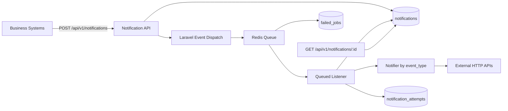
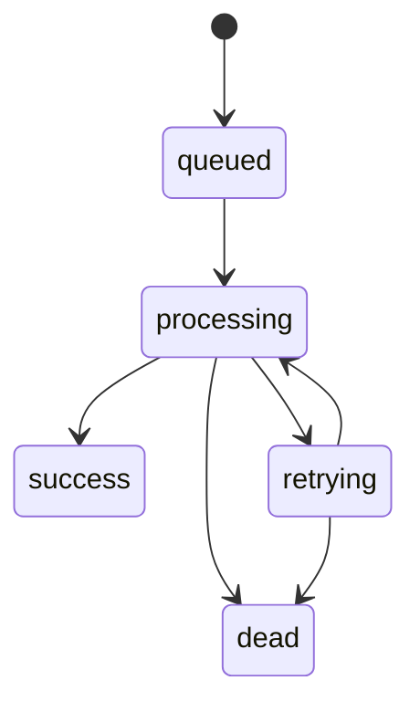

# API Notification System (Laravel MVP)

## 1. Problem Understanding
企业内部业务系统在关键事件发生时，需要把通知投递到不同外部系统（广告、CRM、库存）。
每个外部系统 API 地址、请求体、Header 都不同。业务系统只关心“通知请求被可靠接收并持续投递”，不关心外部 API 的即时返回。

本实现重点：
- 抽象通知事件（`event_type`）
- 不同事件走不同处理方法（Event/Listener + Notifier）
- 异步化 + 重试 + 失败沉淀

## 2. System Boundary
### In scope
- 接收通知请求并做基础校验
- 事件类型分发与异步执行
- 至少一次投递语义
- 重试策略与失败落库
- 通知状态查询

### Out of scope
- Exactly-once
- 多协议（SMTP 等）
- 单事件多目标扇出
- 生产级监控平台接入（例如 Horizon 实际部署）

## 3. Architecture
### High-level flow


### Status transitions


## 4. Event Abstraction
系统以 `event_type` 作为路由键。

当前支持：
- `user_registered_from_ads` -> 广告系统注册回传
- `subscription_paid` -> CRM Contact 状态更新
- `order_purchased` -> 库存变更

每个事件都有：
- 独立 payload 校验（DTO rules）
- 独立 Listener（处理流程）
- 独立 Notifier（外部 API 映射）

## 5. Open-source Middleware Choice and Trade-offs
### Chosen now
- **Laravel Queue + Redis**
  - 原因：Laravel 原生、实现速度快、满足作业 MVP 时间预算。

### Not chosen now
- **Kafka**
  - 没有在 MVP 中接入，避免引入额外基础设施和消费组管理复杂度。

### Alternative if not using current choice
- 不用 Redis Queue：可用 Database Queue（更轻量）
- 流量增长后：可升级 Kafka（更高吞吐、更强解耦）

代码中已保留演进注释：
- 事件映射当前为代码实现，可替换为 DB 配置中心
- 队列调度层当前为 Redis queue，可切换到 Kafka 而不改事件契约

## 6. Reliability and Failure Handling
### Delivery semantics
- `At-least-once`

### Retry policy
- `tries = 6`
- `backoff = [60, 300, 1800]`

### Error classification
- 成功：HTTP `2xx`
- 可重试：超时 / 网络异常 / `429` / `5xx`
- 不可重试：多数 `4xx`（直接 dead）

### Dead letter behavior
- 超过最大重试后由 Laravel 进入 `failed_jobs`
- `notifications.status` 标记为 `dead`

## 7. API Contract
### POST `/api/v1/notifications`
请求：
- `event_type` string
- `biz_id` string
- `idempotency_key` string (optional)
- `payload` object

响应：
- `202`: `{ notification_id, status }`
- `422`: 不支持的事件类型或 payload 校验失败

### GET `/api/v1/notifications/{id}`
返回：
- `status`
- `attempt_count`
- `last_error`
- `next_retry_at`
- `updated_at`

## 8. Data Model
### `notifications`
- 通知主记录
- 幂等键唯一约束（`idempotency_key`）
- 状态字段：`queued/processing/retrying/success/dead`

### `notification_attempts`
- 每次外部调用尝试记录
- 包含目标 URL、请求快照、响应码、错误信息、耗时

### `failed_jobs`
- Laravel 原生失败任务表（最终失败沉淀）

## 9. Engineering Decisions
1. 先做 Redis Queue，不先上 Kafka：
   - 目标是更快得到可验证 MVP，不把时间耗在基础设施搭建。
2. 先代码映射 event_type，不做 DB 配置：
   - 先收敛复杂度，后续可通过接口替换为 DB 配置。
3. 先做单目标通知，不做扇出：
   - 让状态模型和重试逻辑保持清晰。

## 10. Run (Docker)
项目可通过 Docker 运行命令（适合本机无 PHP 环境）：

```bash
# 安装依赖
docker run --rm -u $(id -u):$(id -g) -v "$PWD":/app -w /app composer:2 composer install

# 启动 Redis（若你本机没有 Redis）
docker run -d --name rc-redis -p 6379:6379 redis:7-alpine

# 迁移
docker run --rm -u $(id -u):$(id -g) -v "$PWD":/app -w /app composer:2 php artisan migrate

# 启动 worker（Redis）
docker run --rm -it -u $(id -u):$(id -g) -e REDIS_HOST=host.docker.internal -v "$PWD":/app -w /app composer:2 php artisan queue:work redis --tries=6

# 启动服务
docker run --rm -it -u $(id -u):$(id -g) -e REDIS_HOST=host.docker.internal -p 8000:8000 -v "$PWD":/app -w /app composer:2 php artisan serve --host=0.0.0.0 --port=8000
```

## 11. Monitoring Note
本次 MVP 未实际接入 Horizon。
README 中保留演进建议：后续可接入 Horizon 做队列可视化与告警。

## 12. Collaboration Steps
详细协作与实现过程见 [STEPS.md](./STEPS.md)。
